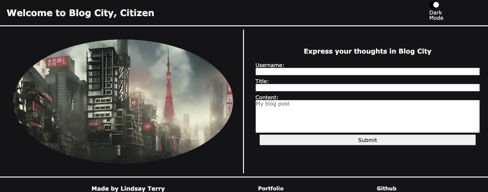
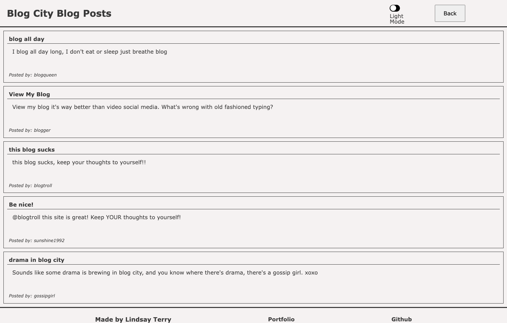

# <blog-city>

## Description

Blog City is an application that provides a way to write blog posts and post them to their own page, only to be seen by those sharing a computer! It utilizes local storage properties to store your blog posts in your browser for you to go back and view later for as long as you want (or until you clear your cookies).  On this project I learned a lot about correctly using local storage to store the right data in the right way, to be able to use it in the way that's expected.  This project was also my first time using more than one file of each type connected to a single project.  It was a little tricky and confusing at first, to navigate between all the pages and to figure out what made sense to go in what page.  I originally had all my theme-switching information in the pages associated with the blog portion of the project, but I realized that with needing the theme to run across all pages, it made more sense to put the theme-switch logic in a central location (logic.js) and have as much styling for the project as I could in style.css to avoid writing the same code twice.  After switching everything over, I realized I only had to make a few minor adjustments to my blog.css to make it look how I wanted, and it made sense to have a centrally located basic stylesheet should I wish to add more pages in the future.  Little to no rework would be required as to getting the theme consistent across all pages and having the light/dark mode work for all.    

One of the greatest challenges surrounding this project was the slider that toggles light and dark modes.  I was able to successfully store all the light and dark mode properties to user storage so it would remember user preference across screens, but the slider toggle would always flip back to default position.  After hours of troubleshooting and trying different methods, I realized I needed to be targeting the label of the checkbox, associate it with the checkbox, and include a boolean in the code so the position (checked or not checked) would store along with the other local storage properties. 

## Installation

N/A

## Usage

To use this application, simply navigate to the URL provided below.  At the top of the page the user will be welcomed to Blog City, and on the right side of the header is an option to select a light or dark mode for viewing ease.  The user will also see a form with some information that's required to fill out: a username, a title for the blog post, and some space to blog about whatever comes to mind.  Upon hitting the submit button (assuming the user has filled in all required fields -- if not, a message will appear directing what still needs to be filled out) the user will be redirected to the Blog Posts page, where they can see their blog post printed on the screen for only them and anyone who shares a browser to see. 

In the header for the Blog Posts page, the user will notice they still have an option to switch between light and dark modes, and they will also see a "back" button.  Hitting the back button will bring them back to the home page to blog some more.  After submitting a second blog entry, the user will be sent back to the Blog Posts page, where they will see their new blog post right beneath the first.  If the user deciedes to close or refresh the page, they will notice their blog posts remain untouched, thanks to local storage!

Click [here](https://lindsay-terry.github.io/blog-city/) to view deployed application.

## Credits

Image of city on home page
Image by <a href="https://pixabay.com/users/aftermathkla-35149745/?utm_source=link-attribution&utm_medium=referral&utm_campaign=image&utm_content=7943648">AftermathKla</a> from <a href="https://pixabay.com//?utm_source=link-attribution&utm_medium=referral&utm_campaign=image&utm_content=7943648">Pixabay</a>

## License

N/A
